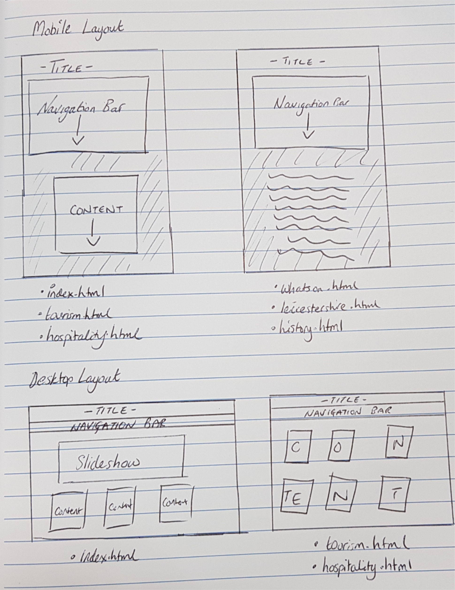

### Created by Upesh Chavda P15186229 - De Montfort University, Leicester
# CTEC3905 Front-End Web Development // Website
## Assignment 2

The way I have designed my website is entirely through the Mobile First layout. 

Here I have a model of what my homepage will look like, simple and easy to use on a mobile phone.



I have chosen a dark blue/white colour scheme as i feel these colours are more readable on a screen which has a dark background.

The colour scheme is shown here:


Details of my directory is as follows:


## Validation/Testing
As of 29/12/2017 23:02, all html pages fully validate through the <a href="http://validator.w3.org">W3 HTML Validator</a>.

As of 29/12/2017 23:05, the css pages fully validate through the <a href="https://jigsaw.w3.org/css-validator/">W3C CSS Validator</a>.

In accordance with the assignment brief, the .js file shows no error in the console.

In order to test the website, I asked people from different backgrounds what they thought of the prototype version. Many people said that the site was well designed and had a good layout, however some made some recommendations for me to change the colour schemes of the site. When asked "Do all the links work correctly", 100% of respondents said yes.

## Issues
Throughout the development of the project, there were numerous errors that occured. One of the first errors was media queries not working as they should be. I later found out that it was due to my media screen size being max width, instead of min width. This led to the media query changing the page for the mobile view instead of the desktop view.

## Software
To develop the website, I used two different HTML editors; <a href="https://notepad-plus-plus.org/">Notepad++</a> and <a href="http://brackets.io/">Brackets</a>, both of which I would recommend. The second editor is my favourite editor as it enables me to view a live demonstration of what code I have changed.

In order to ensure the current versions were up to date, I used <a href="http://github.com>GitHub</a>, which is an opensource version control website to allow programmers to update their current projects.

## Features
### Sitemap
```
<?xml version="1.0" encoding="UTF-8"?>
<urlset
      xmlns:xsi="http://www.w3.org/2001/XMLSchema-instance"
>
<url>
  <loc>https://upeshchavda.github.io/</loc>
  <lastmod>2017-12-29T03:29:43+00:00</lastmod>
  <priority>1.00</priority>
</url>
<url>
  <loc>https://upeshchavda.github.io/index.html</loc>
  <lastmod>2017-12-29T03:29:43+00:00</lastmod>
  <priority>0.80</priority>
</url>
<url>
  <loc>https://upeshchavda.github.io/tourism.html</loc>
  <lastmod>2017-12-29T03:29:43+00:00</lastmod>
  <priority>0.80</priority>
</url>
<url>
  <loc>https://upeshchavda.github.io/hospitality.html</loc>
  <lastmod>2017-12-29T03:29:43+00:00</lastmod>
  <priority>0.80</priority>
</url>
<url>
  <loc>https://upeshchavda.github.io/whatson.html</loc>
  <lastmod>2017-12-29T03:29:43+00:00</lastmod>
  <priority>0.80</priority>
</url>
<url>
  <loc>https://upeshchavda.github.io/leicestershire.html</loc>
  <lastmod>2017-12-29T03:29:43+00:00</lastmod>
  <priority>0.80</priority>
</url>
<url>
  <loc>https://upeshchavda.github.io/history.html</loc>
  <lastmod>2017-12-29T03:29:43+00:00</lastmod>
  <priority>0.80</priority>
</url>
<url>
  <loc>https://upeshchavda.github.io/sitemap.html</loc>
  <lastmod>2017-12-29T03:29:43+00:00</lastmod>
  <priority>0.80</priority>
</url>
</urlset>
```
### API
The only API that I used in the site was from Google Fonts. Each page in the website uses the Google Fonts API, and this helped me to move away from the boring CSS fonts.

### CSS 
Media Query
` @media only screen and (min-width:700px) ` 

Animation
` animation-name: colourchange;
  animation-duration: 4s;
  animation-iteration-count: 2; `
  
```
@keyframes colourchange {
  0%   {background-color:#373F51;}
  12.5%  {background-color:#ff0000;}
  25%  {background-color:#373F51;}
  37.5%  {background-color:#ff7878;}
  50% {background-color:#373F51;}
  62.5%   {background-color:#74d680;}
  75%  {background-color:#373F51;}
  87.5%  {background-color:#378b29;}
  100%  {background-color:#373F51;}
} 
```

Transition 
` transition: 1s; `
