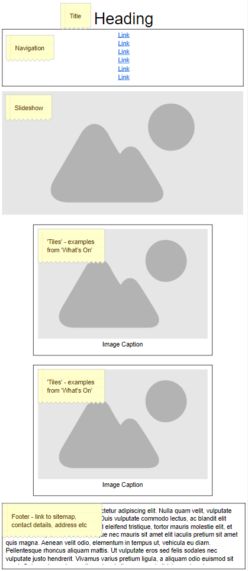
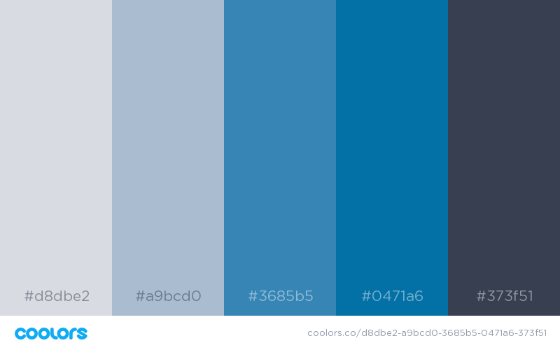
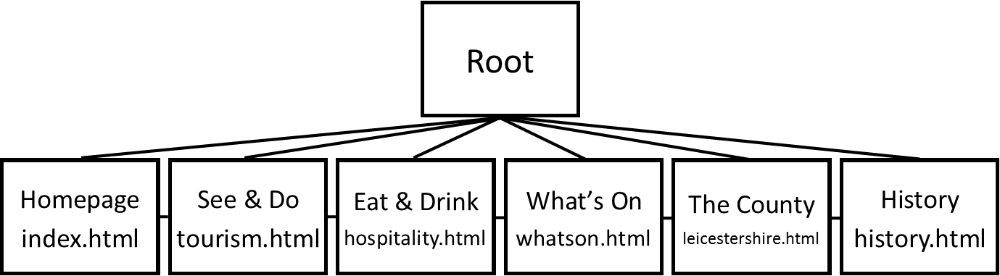

# CTEC3905 Front-End Web Development // Website
## Assignment 2

The way I have designed my website is entirely through the Mobile First layout. 

Here I have a model of what my homepage will look like, simple and easy to use on a mobile phone.

I have chosen a dark blue/white colour scheme as i feel these colours are more readable on a screen which has a dark background.

The colour scheme is shown here:

Details of my directory is as follows:

